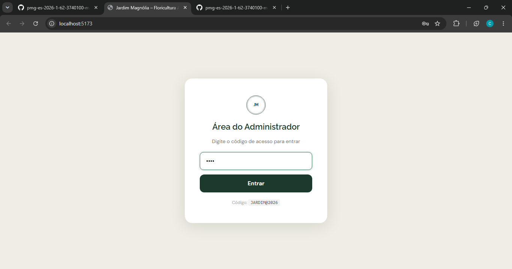
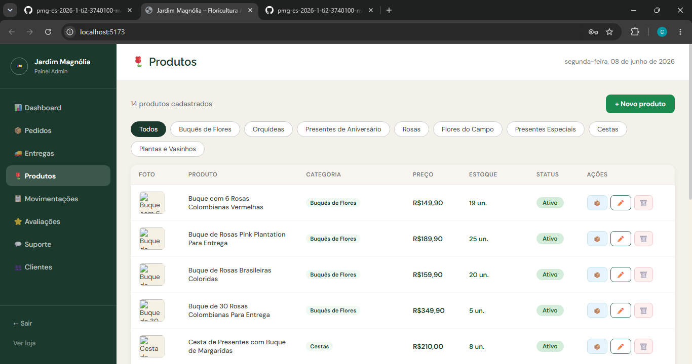
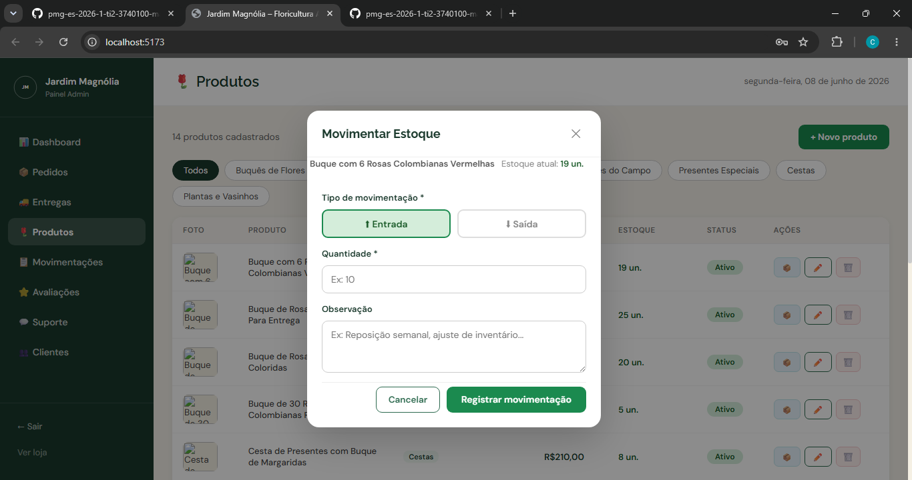
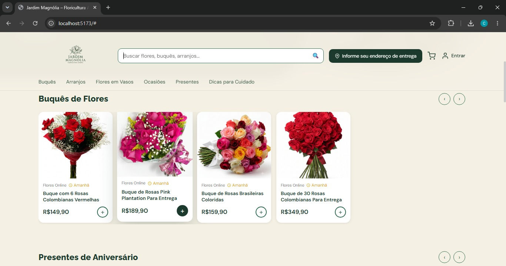
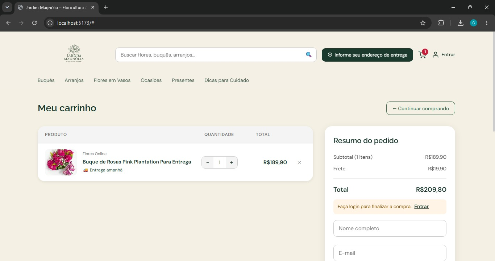
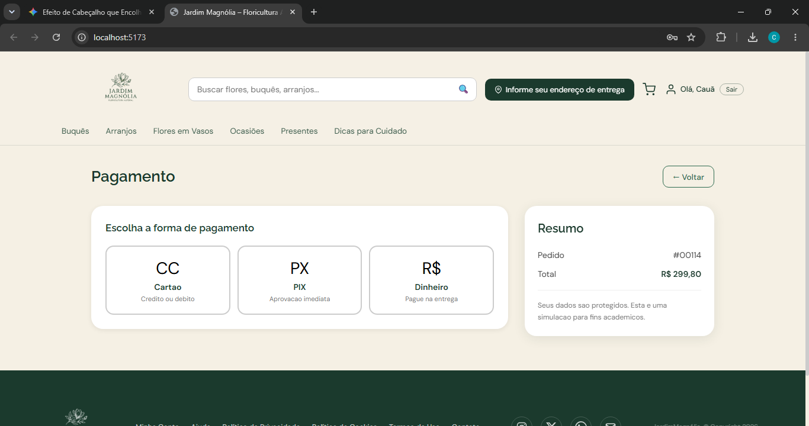
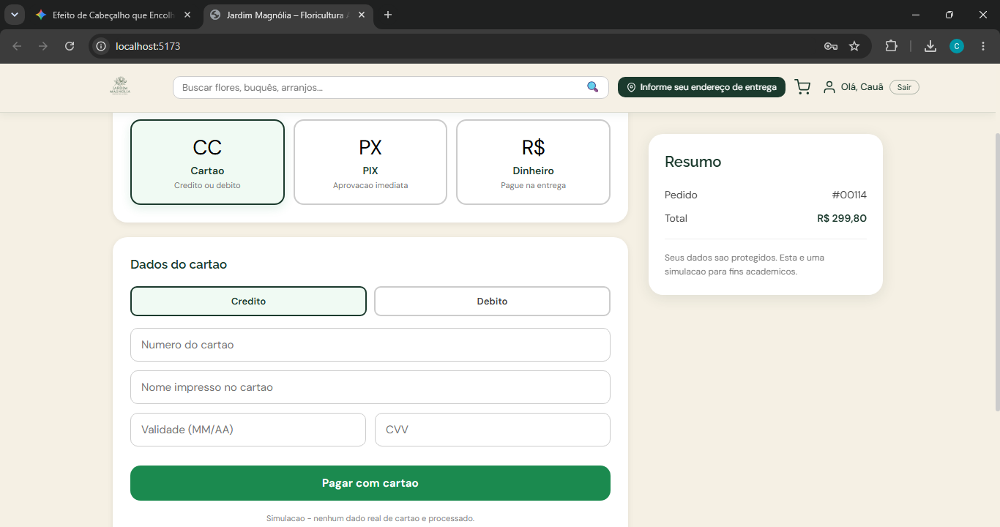
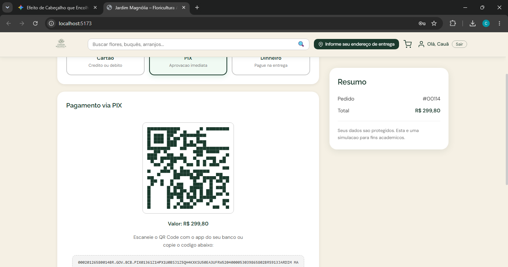
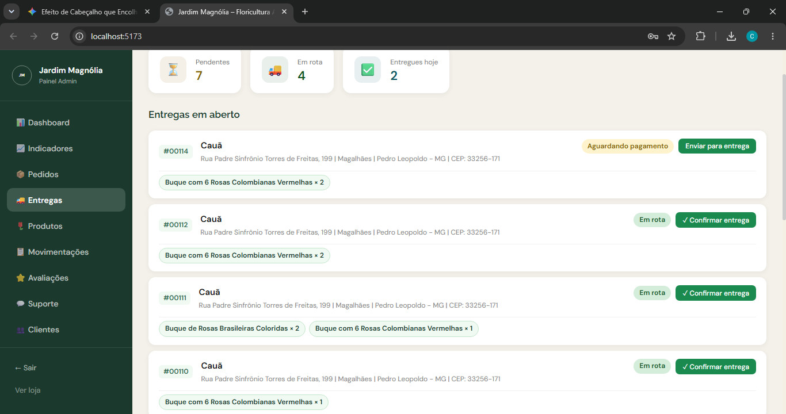
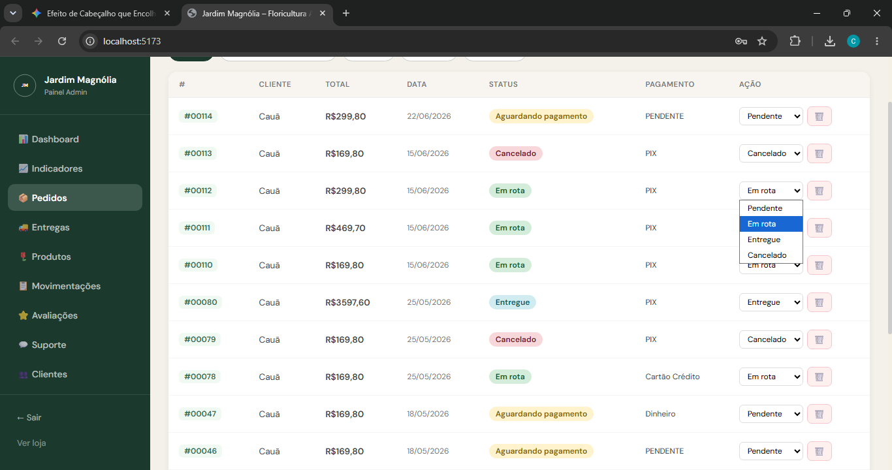

## 6. Interface do sistema

_Visão geral da interação do usuário por meio das telas do sistema. Apresente as principais interfaces da plataforma._

## 6.1. Tela principal do sistema

A tela principal do Jardim Magnólia é o ponto de entrada da plataforma e está organizada em quatro seções:

**Hero:** painel verde com formato orgânico exibindo foto de flores, o slogan "Presentes para quem você ama entregues hoje em todo o Brasil", destaque para entrega em até 3 horas e botão de acesso ao catálogo.

**Carrosséis de produtos:** oito carrosséis horizontais categorizados (Buquês, Orquídeas, Aniversário, Rosas, Campo, Presentes, Cestas e Plantas), cada card exibindo foto, nome, preço e botão de adicionar ao carrinho. A barra de busca da navegação filtra os produtos em tempo real nessas listagens.

**Avaliações:** grid com depoimentos de clientes reais, exibindo nota em estrelas, comentário, nome e data.

**Presentes Online:** grade de categorias de presentes com ícones e rótulos, com atalho para a página de presentes.

## 6.2. Telas do processo 1 (Estoque)

_Tela de autenticação e listagem de produtos._

A tela de **Login Admin** exibe um formulário centralizado com campos de e-mail e senha. Somente usuários com perfil de administrador têm acesso liberado; credenciais inválidas encerram o fluxo com mensagem de acesso negado.

Após autenticação bem-sucedida, a tela de **Produtos** apresenta a listagem completa do catálogo em formato de tabela, com as colunas: imagem, nome, categoria, preço, quantidade em estoque e status (ativo/inativo). Um botão de edição em cada linha permite selecionar o produto para ajuste de estoque.

_Tela de movimentação de estoque._

A tela de **Movimentação de Estoque** é exibida ao selecionar um produto para edição. Ela apresenta o nome do produto e o estoque atual em modo somente leitura, um campo numérico para informar a nova quantidade (valor obrigatório, maior ou igual a zero) e os botões **Salvar** — que valida e persiste a alteração no backend — e **Cancelar** — que retorna à listagem sem modificações. Após salvar com sucesso, a listagem é recarregada exibindo o estoque atualizado.

## 6.3. Telas do processo 2 (Venda)

_Tela de visualização do produto._

A tela de **Visualização do Produto** é exibida quando o cliente clica em um item nos carrosséis da home ou na página de presentes. Ela apresenta a galeria de imagens cadastradas pelo administrador (com thumbnails clicáveis quando há mais de uma foto), o nome do produto, a descrição, o preço com opção de parcelamento, a seleção de data de entrega, o controle de quantidade e o botão **Comprar agora**, que adiciona o item ao carrinho e direciona o cliente para a próxima etapa do fluxo de venda. Abaixo da galeria, são exibidas as avaliações dos clientes e um formulário para que o usuário logado possa registrar sua própria avaliação.

_Tela do carrinho de compras._

A tela do **Carrinho** apresenta a lista dos itens adicionados, com nome, imagem, preço unitário e controles de quantidade e remoção, além do resumo do pedido (subtotal, frete e total). Nessa tela o cliente preenche os dados necessários para a entrega — CEP, endereço completo, número, complemento e tipo de frete — e, após confirmar as informações, avança para a tela de **Pagamento**, onde escolhe a forma de pagamento (cartão, Pix ou boleto) e finaliza a compra. Concluída essa etapa, o pedido é registrado no sistema e encaminhado para o subprocesso de pagamento, dando continuidade ao processo de venda.

## 6.4. Telas do processo 3 (Pagamento)

_Tela de seleção do método de pagamento._

Após confirmar os dados do carrinho, o cliente é direcionado para a tela de **Pagamento**, que exibe o resumo do pedido (itens, subtotal, frete e total a pagar) e as três formas de pagamento disponíveis: **Cartão** (crédito ou débito), **PIX** (com aprovação imediata) e **Dinheiro** (pagamento na entrega). Cada opção é apresentada como um card clicável com ícone, nome e descrição curta. Ao selecionar um método, a tela exibe dinamicamente o formulário ou as instruções correspondentes à forma escolhida.

_Tela de pagamento por cartão._

Ao escolher **Cartão**, o sistema apresenta um formulário para o cliente informar os dados do cartão: tipo (crédito ou débito, alternáveis por botões), número do cartão (com máscara automática de 16 dígitos agrupados em blocos de 4), nome impresso no cartão, validade no formato MM/AA e CVV. Todos os campos são validados localmente antes do envio — número com pelo menos 13 dígitos, validade com 5 caracteres e CVV com no mínimo 3 dígitos. Após o preenchimento e confirmação, o pedido é enviado ao backend que registra o pagamento com status **APROVADO** e atualiza o pedido para **EM ROTA**.

_Tela de pagamento por PIX._

Ao escolher **PIX**, a tela exibe um QR Code gerado dinamicamente, o valor total da compra e o código copia-e-cola da chave PIX. O cliente pode escanear o QR Code com o aplicativo do banco ou copiar o código para realizar o pagamento manualmente. Ao concluir a transferência, o cliente clica em **Já paguei – confirmar** e o sistema registra o pagamento como **APROVADO**, atualizando o pedido para **EM ROTA**. Por se tratar de uma simulação acadêmica, o QR Code e o código são gerados aleatoriamente, sem integração real com o sistema bancário.

## 6.5. Telas do processo 4 (Entrega)

_Tela administrativa de gestão das entregas._

A tela **Entregas** do painel administrativo concentra a gestão das entregas em aberto. No topo são exibidos três cards de métricas — **Pendentes**, **Em rota** e **Entregues hoje** — que apresentam, em tempo real, a contagem de pedidos em cada estado. Abaixo, a seção **Entregas em aberto** lista os pedidos pendentes ou em rota com número do pedido (#00001), nome do cliente, endereço de entrega, badge colorido de status e os itens do pedido. Para cada pedido, o administrador tem dois botões de ação: **Enviar para entrega**, exibido quando o status é PENDENTE — que aciona o endpoint `PATCH /api/pedidos/{id}/status` movendo o pedido para EM ROTA; e **✓ Confirmar entrega**, exibido quando o status é EM ROTA — que conclui o fluxo marcando o pedido como ENTREGUE. Após a confirmação, o pedido sai da lista de pendências e passa a contar nas métricas de entregues do dia.

_Painel do cliente para acompanhamento da entrega._

A tela **Minha Conta** do cliente apresenta o histórico completo de pedidos com o status atualizado de cada um. No cabeçalho, são exibidos os totalizadores **Pedidos realizados**, **Pedidos entregues** e **Total gasto**. Cada pedido é apresentado em um card com número do pedido, data, valor total, lista de itens e um badge colorido indicando o estado da entrega — **Aguardando pagamento** (amarelo), **Em rota** (verde), **Entregue** (azul) ou **Cancelado** (vermelho) — refletindo em tempo real as atualizações feitas pelo administrador no painel de entregas. Para pedidos com status **EM ROTA** ou **ENTREGUE**, fica disponível ainda a opção de solicitar devolução, que registra a abertura do processo de reembolso no backend.

