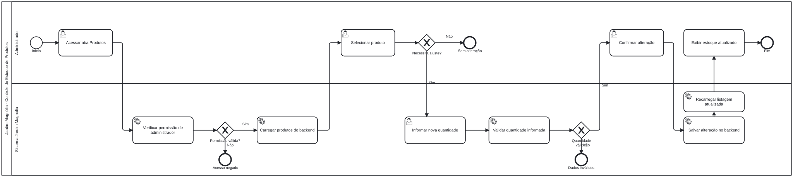
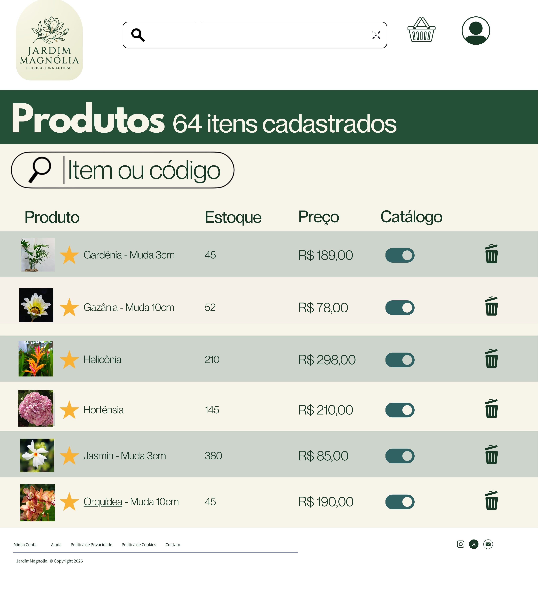

### 3.3.1 Processo 1 – Controle de Estoque de Produtos

O **Processo 1** corresponde ao **controle de estoque de produtos** do sistema **Jardim Magnólia**. Esse processo representa as atividades realizadas pelo administrador na aba **Produtos**, responsável por consultar os itens cadastrados, visualizar o estoque disponível, selecionar um produto e alterar sua quantidade em estoque. No sistema, os produtos possuem atributos como **nome**, **preço**, **imagem**, **estoque**, **status ativo/inativo**, **categoria** e **descrição**, o que fundamenta a modelagem deste processo. Além disso, a área administrativa permite carregar a lista de produtos e salvar alterações no backend, mantendo as informações do catálogo atualizadas.

As principais **oportunidades de melhoria** identificadas para esse processo são:

- Implementar alerta automático para produtos com estoque baixo;
- Registrar histórico de movimentações de estoque;
- Bloquear vendas quando o estoque estiver zerado;
- Integrar a baixa automática do estoque após confirmação do pedido;
- Permitir justificativa obrigatória para ajustes manuais no estoque.

Em seguida, apresenta-se o modelo BPMN do processo de estoque.

#### Descrição do modelo BPMN

O processo inicia quando o administrador acessa a área de produtos. Em seguida, ele consulta o estoque atual e seleciona o produto que deseja analisar. Depois disso, verifica se há necessidade de ajuste na quantidade disponível. Caso não haja necessidade de alteração, o processo é encerrado. Caso exista necessidade, o administrador informa a nova quantidade em estoque, salva a alteração e, por fim, consulta novamente a listagem para confirmar a atualização dos dados.

#### Detalhamento das atividades

As atividades apresentadas abaixo estão diretamente relacionadas ao modelo BPMN do processo de estoque.

---

**Acessar aba Produtos**

| **Campo** | **Tipo** | **Restrições** | **Valor default** |
| --- | --- | --- | --- |
| código de acesso | Caixa de texto | obrigatório | vazio |
| perfil de usuário | Seleção única | deve ser administrador | administrador |

| **Comandos** | **Destino** | **Tipo** |
| --- | --- | --- |
| entrar | Consultar estoque atual | default |
| cancelar | Fim do Processo 1 | cancel |

---

**Consultar estoque atual**

| **Campo** | **Tipo** | **Restrições** | **Valor default** |
| --- | --- | --- | --- |
| lista de produtos | Tabela | somente leitura | carregada do sistema |
| nome do produto | Caixa de texto | somente leitura | conforme cadastro |
| categoria | Seleção única | somente leitura | conforme cadastro |
| preço | Número | somente leitura | conforme cadastro |
| estoque | Número | somente leitura | conforme cadastro |
| status | Seleção única | somente leitura | ativo/inativo |
| imagem | Imagem | opcional | conforme cadastro |

| **Comandos** | **Destino** | **Tipo** |
| --- | --- | --- |
| selecionar produto | Selecionar produto | default |
| sair | Fim do Processo 1 | cancel |

---

**Selecionar produto**

| **Campo** | **Tipo** | **Restrições** | **Valor default** |
| --- | --- | --- | --- |
| id do produto | Número | obrigatório | vazio |
| nome do produto | Caixa de texto | obrigatório | vazio |
| estoque atual | Número | somente leitura | conforme cadastro |

| **Comandos** | **Destino** | **Tipo** |
| --- | --- | --- |
| continuar | Verificar necessidade de ajuste | default |
| voltar | Consultar estoque atual | cancel |

---

**Verificar necessidade de ajuste**

| **Campo** | **Tipo** | **Restrições** | **Valor default** |
| --- | --- | --- | --- |
| produto selecionado | Caixa de texto | obrigatório | item selecionado |
| estoque atual | Número | somente leitura | quantidade atual |
| necessidade de ajuste | Seleção única | sim ou não | não |

| **Comandos** | **Destino** | **Tipo** |
| --- | --- | --- |
| ajustar estoque | Informar nova quantidade | default |
| encerrar | Fim do Processo 1 | cancel |

---

**Informar nova quantidade**

| **Campo** | **Tipo** | **Restrições** | **Valor default** |
| --- | --- | --- | --- |
| nome do produto | Caixa de texto | somente leitura | item selecionado |
| estoque atual | Número | somente leitura | quantidade atual |
| nova quantidade | Número | obrigatório, maior ou igual a zero | vazio |
| motivo do ajuste | Área de texto | opcional | vazio |

| **Comandos** | **Destino** | **Tipo** |
| --- | --- | --- |
| salvar alteração | Salvar alteração de estoque | default |
| cancelar | Consultar estoque atual | cancel |

---

**Salvar alteração de estoque**

| **Campo** | **Tipo** | **Restrições** | **Valor default** |
| --- | --- | --- | --- |
| nome do produto | Caixa de texto | somente leitura | item selecionado |
| nova quantidade | Número | obrigatório | valor informado |
| data e hora da alteração | Data e Hora | gerado automaticamente | data e hora atual |

| **Comandos** | **Destino** | **Tipo** |
| --- | --- | --- |
| confirmar | Visualizar estoque atualizado | default |
| cancelar | Informar nova quantidade | cancel |

---

**Visualizar estoque atualizado**

| **Campo** | **Tipo** | **Restrições** | **Valor default** |
| --- | --- | --- | --- |
| lista de produtos atualizada | Tabela | somente leitura | carregada do sistema |
| produto atualizado | Caixa de texto | somente leitura | item alterado |
| estoque atualizado | Número | somente leitura | nova quantidade |
| status do produto | Seleção única | somente leitura | ativo/inativo |

| **Comandos** | **Destino** | **Tipo** |
| --- | --- | --- |
| finalizar | Fim do Processo 1 | default |
| novo ajuste | Consultar estoque atual | cancel |

---

#### Observações complementares

O processo de estoque foi modelado com foco exclusivo na funcionalidade administrativa de produtos do sistema Jardim Magnólia. Dessa forma, o fluxo não inclui etapas de pedido, pagamento, entrega ou avaliação, pois essas funcionalidades pertencem a outros processos do sistema. O objetivo aqui é representar de forma clara e objetiva a rotina de manutenção do estoque, facilitando o entendimento do funcionamento da área administrativa e apoiando a documentação do projeto no padrão BPMN.
