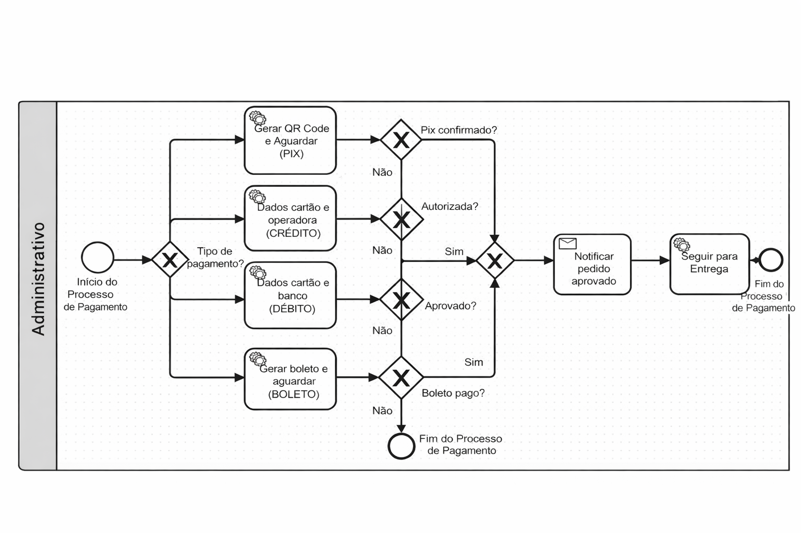

### 3.3.3 Processo 3 – Processo de Pagamento

_O processo de pagamento contempla a seleção do método de pagamento, validação da transação e confirmação do pagamento para liberação do pedido._

#### Detalhamento das atividades

O processo de pagamento se inicia quando o cliente seleciona o método de pagamento desejado. Essa escolha direciona todo o fluxo subsequente, podendo seguir pelos caminhos de PIX, cartão de crédito, cartão de débito ou boleto bancário.

No pagamento via PIX, o sistema gera um QR Code e aguarda a confirmação da transação. Caso o pagamento seja realizado com sucesso, o processo segue para a etapa final. No entanto, se o PIX não for pago dentro do prazo ou não for confirmado, o fluxo não avança e retorna para a etapa de escolha do método de pagamento, permitindo que o cliente tente novamente com o mesmo ou outro método.

Para pagamentos com cartão de crédito, o cliente informa os dados do cartão, que são enviados para a operadora para análise. O sistema verifica se a transação foi autorizada. Caso seja aprovada, o processo continua normalmente. Porém, se a operadora não autorizar o pagamento, o fluxo é interrompido e retorna à etapa de seleção do método de pagamento, permitindo a correção dos dados ou a escolha de outra forma de pagamento.

No caso do cartão de débito, o cliente também informa seus dados, e o banco realiza a verificação da transação. Se o pagamento for aprovado, o processo segue. Caso contrário, ou seja, se o pagamento for negado, o sistema não dá continuidade ao fluxo e redireciona o cliente para tentar novamente ou selecionar outro método de pagamento.

Para o boleto bancário, o sistema gera o documento e aguarda o pagamento. O processo só avança quando o boleto é quitado. Caso o pagamento não seja realizado, o fluxo não é concluído e retorna para a etapa inicial, permitindo uma nova tentativa.

Em todos os cenários, existe um ponto de decisão que verifica se o pagamento foi confirmado, autorizado ou aprovado. Quando a resposta é positiva, o fluxo segue para a unificação do processo, onde o pedido é marcado como aprovado e o cliente é notificado.

Por outro lado, sempre que o pagamento não é aprovado, autorizado ou confirmado, o processo não avança para a finalização e retorna à etapa de seleção do método de pagamento. Isso garante que o cliente tenha a oportunidade de corrigir erros ou escolher outra forma de pagamento.

Por fim, após a confirmação bem-sucedida do pagamento, o sistema notifica a aprovação do pedido e segue para a etapa de entrega, encerrando o processo de pagamento.

---

**Selecionar método de pagamento**

| **Campo**       | **Tipo**       | **Restrições**                             | **Valor default** |
| --------------- | -------------- | ------------------------------------------ | ----------------- |
| metodoPagamento | Lista suspensa | obrigatório (PIX, Crédito, Débito, Boleto) |                   |

| **Comandos** | **Destino**                  | **Tipo** |
| ------------ | ---------------------------- | -------- |
| continuar    | Verificar tipo de pagamento  | default  |
| cancelar     | Fim do processo de pagamento | cancel   |

---

**Pagamento via PIX**

| **Campo**       | **Tipo** | **Restrições**         | **Valor default** |
| --------------- | -------- | ---------------------- | ----------------- |
| qrCode          | Exibição | gerado automaticamente | automático        |
| statusPagamento | Texto    | somente leitura        | aguardando        |

| **Comandos**        | **Destino**                    | **Tipo** |
| ------------------- | ------------------------------ | -------- |
| confirmar pagamento | Verificar pagamento PIX        | default  |
| cancelar            | Selecionar método de pagamento | cancel   |

---

**Pagamento via Cartão de Crédito**

| **Campo**    | **Tipo**       | **Restrições**          | **Valor default** |
| ------------ | -------------- | ----------------------- | ----------------- |
| numeroCartao | Caixa de Texto | obrigatório, 16 dígitos |                   |
| nomeTitular  | Caixa de Texto | obrigatório             |                   |
| validade     | Caixa de Texto | formato MM/AA           |                   |
| cvv          | Caixa de Texto | 3 dígitos               |                   |

| **Comandos** | **Destino**                    | **Tipo** |
| ------------ | ------------------------------ | -------- |
| pagar        | Verificar autorização crédito  | default  |
| cancelar     | Selecionar método de pagamento | cancel   |

---

**Pagamento via Cartão de Débito**

| **Campo**    | **Tipo**       | **Restrições**          | **Valor default** |
| ------------ | -------------- | ----------------------- | ----------------- |
| numeroCartao | Caixa de Texto | obrigatório, 16 dígitos |                   |
| nomeTitular  | Caixa de Texto | obrigatório             |                   |
| validade     | Caixa de Texto | formato MM/AA           |                   |
| senha        | Caixa de Texto | obrigatório             |                   |

| **Comandos** | **Destino**                    | **Tipo** |
| ------------ | ------------------------------ | -------- |
| pagar        | Verificar aprovação débito     | default  |
| cancelar     | Selecionar método de pagamento | cancel   |

---

**Pagamento via Boleto**

| **Campo**       | **Tipo** | **Restrições**         | **Valor default** |
| --------------- | -------- | ---------------------- | ----------------- |
| codigoBarras    | Exibição | gerado automaticamente | automático        |
| statusPagamento | Texto    | somente leitura        | aguardando        |

| **Comandos**        | **Destino**                    | **Tipo** |
| ------------------- | ------------------------------ | -------- |
| confirmar pagamento | Verificar pagamento boleto     | default  |
| cancelar            | Selecionar método de pagamento | cancel   |

---

**Notificar pedido aprovado**

| **Campo** | **Tipo** | **Restrições** | **Valor default**  |
| --------- | -------- | -------------- | ------------------ |
| mensagem  | Texto    | informativo    | pagamento aprovado |

| **Comandos** | **Destino**         | **Tipo** |
| ------------ | ------------------- | -------- |
| continuar    | Seguir para entrega | default  |

