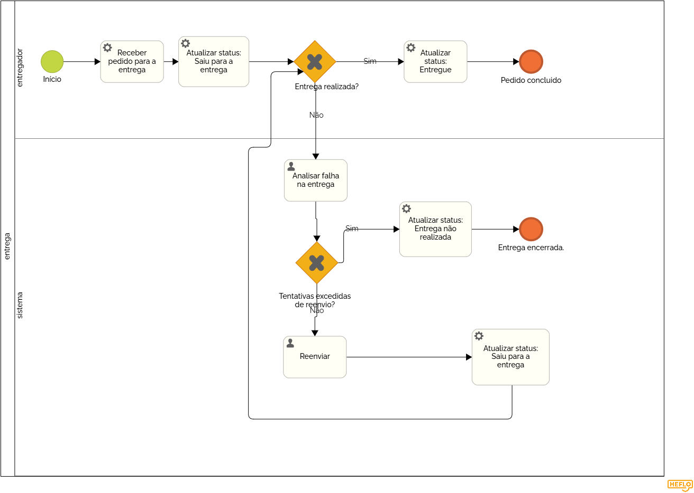
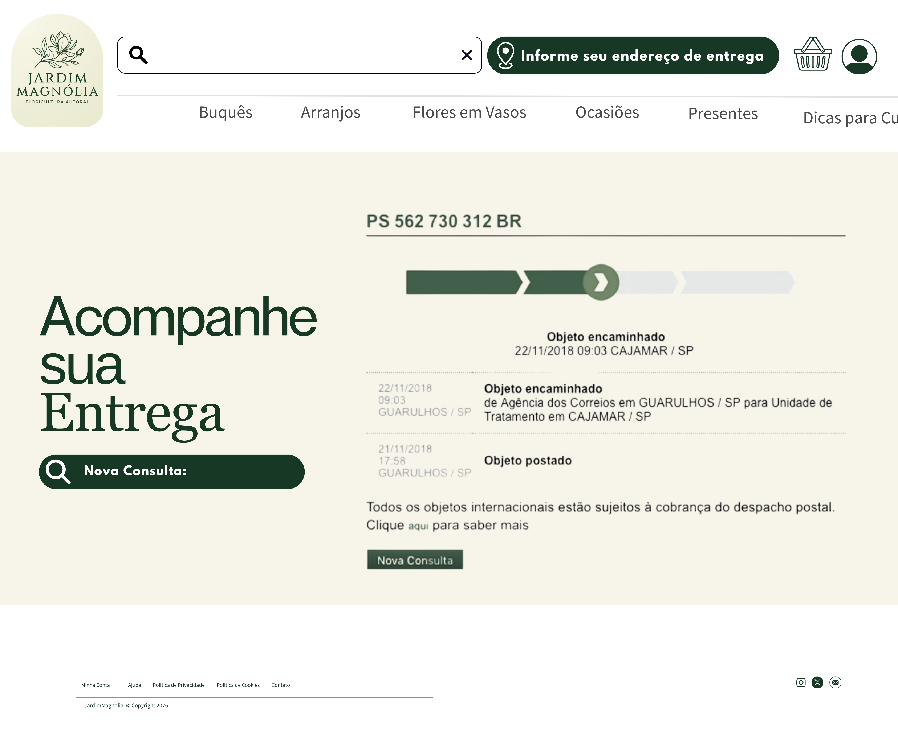
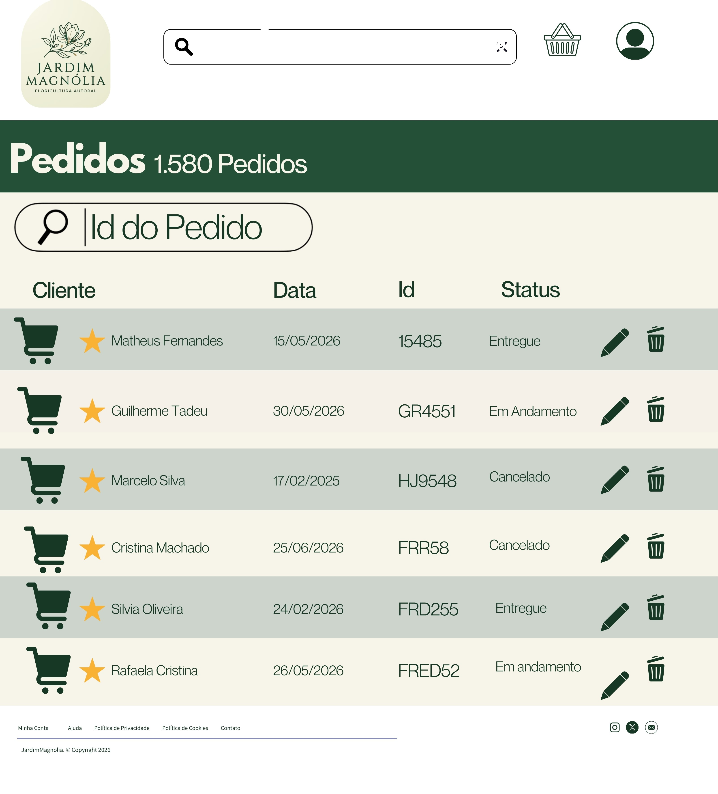

### 3.3.4 Processo 4 – Processo de Entrega

_O processo de entrega contempla desde a confirmação do pedido até a finalização da entrega ao cliente._

#### Detalhamento das atividades

O processo de entrega inicia com a ação do cliente ao realizar um pedido na plataforma, informando os dados necessários como produto, endereço, data e horário de entrega. Essa etapa é fundamental, pois define todas as informações que serão utilizadas nas etapas seguintes.

Na sequência, ocorre o processamento do pagamento, onde o sistema valida a transação. Caso o pagamento seja aprovado, o pedido é confirmado e segue no fluxo. Em caso de falha, o processo é encerrado.

Após a confirmação, a floricultura é notificada com os detalhes do pedido, permitindo que o vendedor tenha acesso às informações necessárias para dar continuidade ao atendimento.

Em seguida, é realizada a verificação de disponibilidade do produto em estoque. Caso o item não esteja disponível, o pedido é cancelado e o reembolso é acionado automaticamente. Caso esteja disponível, o processo continua.

A etapa de separação do produto consiste na preparação do item solicitado, incluindo a identificação com os dados do destinatário, garantindo a correta entrega.

Posteriormente, é feita a definição do entregador, onde é selecionado o responsável pela entrega e o meio de transporte adequado.

Após essa definição, o pedido é enviado para entrega, e o cliente é notificado sobre o status de envio.

Na etapa de confirmação de entrega, o entregador registra no sistema se a entrega foi realizada com sucesso. Caso o destinatário esteja ausente ou haja erro no endereço, o pedido pode ser reagendado, retornando a etapas anteriores do processo.

Por fim, com a entrega realizada, o pedido é concluído. O cliente recebe a confirmação final e pode avaliar o serviço prestado, contribuindo para a melhoria contínua da plataforma.

### **Cliente faz o pedido**

| **Campo**           | **Tipo**         | **Restrições**                  | **Valor default** |
|--------------------|------------------|--------------------------------|-------------------|
| Produto            | Seleção única    | obrigatório                    |                   |
| Endereço           | Área de texto    | obrigatório                    |                   |
| Data de entrega    | Data             | formato dd-mm-aaaa             |                   |
| Hora de entrega    | Hora             | formato hh:mm:ss               |                   |
| Mensagem           | Área de texto    | opcional                       |                   |

| **Comandos** | **Destino**                | **Tipo** |
|--------------|---------------------------|----------|
| Confirmar    | Processar pagamento       | default  |
| Cancelar     | Fim do processo           | cancel   |

---

### **Processar pagamento**

| **Campo**         | **Tipo**        | **Restrições**              | **Valor default** |
|------------------|-----------------|-----------------------------|-------------------|
| Status pagamento | Seleção única   | aprovado / recusado         |                   |
| Código transação | Caixa de texto  | obrigatório                 |                   |

| **Comandos** | **Destino**             | **Tipo** |
|--------------|------------------------|----------|
| Confirmar    | Notificar vendedor     | default  |
| Cancelar     | Fim do processo        | cancel   |

---

### **Notificar vendedor**

| **Campo**        | **Tipo**        | **Restrições** | **Valor default** |
|-----------------|-----------------|----------------|-------------------|
| Dados do pedido | Área de texto   | obrigatório    |                   |

| **Comandos** | **Destino**                 | **Tipo** |
|--------------|----------------------------|----------|
| Enviar       | Verificar disponibilidade  | default  |

---

### **Verificar disponibilidade**

| **Campo**        | **Tipo**        | **Restrições**           | **Valor default** |
|-----------------|-----------------|--------------------------|-------------------|
| Produto em estoque | Seleção única | sim / não                |                   |

| **Comandos** | **Destino**                 | **Tipo** |
|--------------|----------------------------|----------|
| Disponível   | Separar produto            | default  |
| Indisponível | Cancelamento/Reembolso     | cancel   |

---

### **Separar produto**

| **Campo**         | **Tipo**        | **Restrições** | **Valor default** |
|------------------|-----------------|----------------|-------------------|
| Produto separado | Seleção única   | sim            |                   |
| Identificação    | Área de texto   | obrigatório    |                   |

| **Comandos** | **Destino**            | **Tipo** |
|--------------|------------------------|----------|
| Confirmar    | Definir entregador     | default  |

---

### **Definir entregador**

| **Campo**        | **Tipo**        | **Restrições** | **Valor default** |
|-----------------|-----------------|----------------|-------------------|
| Entregador      | Seleção única   | obrigatório    |                   |
| Tipo entrega    | Seleção única   | moto / carro   |                   |

| **Comandos** | **Destino**            | **Tipo** |
|--------------|------------------------|----------|
| Confirmar    | Saiu para entrega      | default  |

---

### **Saiu para entrega**

| **Campo**         | **Tipo**        | **Restrições** | **Valor default** |
|------------------|-----------------|----------------|-------------------|
| Status envio     | Seleção única   | enviado        |                   |

| **Comandos** | **Destino**              | **Tipo** |
|--------------|--------------------------|----------|
| Notificar    | Confirmação de entrega   | default  |

---

### **Confirmação de entrega**

| **Campo**        | **Tipo**        | **Restrições**         | **Valor default** |
|-----------------|-----------------|------------------------|-------------------|
| Entrega realizada | Seleção única | sim / não              |                   |
| Observação      | Área de texto   | opcional               |                   |

| **Comandos** | **Destino**              | **Tipo** |
|--------------|--------------------------|----------|
| Confirmar    | Pedido concluído         | default  |
| Reagendar    | Definir entregador       |          |

---

### **Pedido concluído**

| **Campo**     | **Tipo**        | **Restrições** | **Valor default** |
|---------------|-----------------|----------------|-------------------|
| Avaliação     | Número          | 1 a 5          |                   |
| Comentário    | Área de texto   | opcional       |                   |

| **Comandos** | **Destino**        | **Tipo** |
|--------------|--------------------|----------|
| Finalizar    | Fim do processo    | default  |
