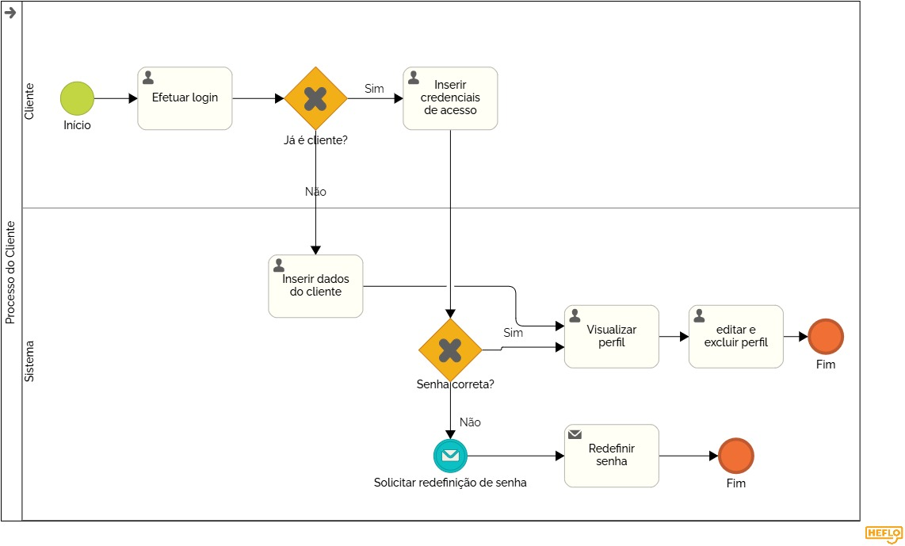
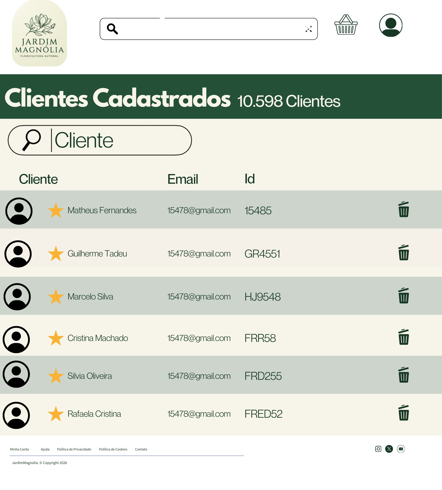

### 3.3.5 Processo 5 – Processo do Cliente

*O processo do cliente compreende a jornada de identificação, autenticação e a gestão da área logada, onde o usuário mantém seus dados de entrega e histórico de interações com o Jardim Magnólia.*

#### Detalhamento das atividades

O processo do cliente inicia com a ação de **Solicitar acesso à conta**, onde o usuário acessa a interface de identificação do sistema. Nesse momento, o sistema apresenta opções para usuários já cadastrados e para novos visitantes.

Caso o cliente não possua cadastro, ele segue para a etapa de **Cadastrar dados**, fornecendo informações essenciais. Na sequência, ocorre a **Coleta e validação de dados**, onde o sistema verifica a integridade das informações (como CPF e e-mail) antes de liberar o acesso definitivo.

Para clientes já cadastrados, o fluxo segue para **O cliente insere suas credenciais de acesso**. O sistema realiza a verificação da senha; se estiver correta, o acesso ao perfil é liberado. Caso a senha esteja incorreta, o cliente é direcionado para a atividade de **Redefinir senha**, onde poderá atualizar sua credencial e retornar para a tentativa de login.

Por fim, após a autenticação ou conclusão do cadastro, o cliente chega à etapa de **Visualizar e gerenciar perfil**. Nesta área, o usuário tem autonomia para editar seus dados pessoais, gerenciar endereços de entrega e consultar seu histórico completo de pedidos, encerrando o processo ao finalizar suas interações na conta.

-----

### **Solicitar acesso a conta**

| **Campo**           | **Tipo**         | **Restrições**                  | **Valor default** |
|--------------------|------------------|--------------------------------|-------------------|
| Opção de acesso    | Botão / Link     | obrigatório (Login ou Cadastro)|                   |

| **Comandos**     | **Destino**                                | **Tipo** |
|------------------|--------------------------------------------|----------|
| Já sou cliente   | O cliente insere suas credenciais de acesso| default  |
| Criar conta      | Cadastrar dados                            |          |

-----

### **O cliente insere suas credenciais de acesso**

| **Campo**           | **Tipo**         | **Restrições**                  | **Valor default** |
|--------------------|------------------|--------------------------------|-------------------|
| E-mail             | Caixa de texto   | formato de e-mail              |                   |
| Senha              | Caixa de texto   | obrigatório                    |                   |

| **Comandos**     | **Destino**                                | **Tipo** |
|------------------|--------------------------------------------|----------|
| Entrar           | Senha correta? (Decisão)                   | default  |
| Esqueci senha    | Redefinir senha                            | cancel   |

-----

### **Cadastrar dados**

| **Campo**           | **Tipo**         | **Restrições**                  | **Valor default** |
|--------------------|------------------|--------------------------------|-------------------|
| Nome Completo      | Caixa de texto   | obrigatório                    |                   |
| CPF                | Caixa de texto   | formato 000.000.000-00         |                   |
| E-mail             | Caixa de texto   | único no sistema               |                   |
| Criar Senha        | Caixa de texto   | mínimo 8 caracteres            |                   |

| **Comandos**     | **Destino**                                | **Tipo** |
|------------------|--------------------------------------------|----------|
| Continuar        | Coleta e validação de dados                | default  |
| Cancelar         | Solicitar acesso a conta                   | cancel   |

-----

### **Coleta e validação de dados**

| **Campo**           | **Tipo**         | **Restrições**                  | **Valor default** |
|--------------------|------------------|--------------------------------|-------------------|
| Status da validação| Seleção única    | aprovado / erro nos dados      |                   |

| **Comandos**     | **Destino**                                | **Tipo** |
|------------------|--------------------------------------------|----------|
| Confirmar        | Visualizar e gerenciar perfil              | default  |
| Corrigir         | Cadastrar dados                            | cancel   |

-----

### **Redefinir senha**

| **Campo**           | **Tipo**         | **Restrições**                  | **Valor default** |
|--------------------|------------------|--------------------------------|-------------------|
| E-mail cadastrado  | Caixa de texto   | deve existir na base           |                   |
| Nova Senha         | Caixa de texto   | mínimo 8 caracteres            |                   |

| **Comandos**     | **Destino**                                | **Tipo** |
|------------------|--------------------------------------------|----------|
| Salvar           | O cliente insere suas credenciais de acesso| default  |

-----

### **Visualizar e gerenciar perfil**

| **Campo**           | **Tipo**         | **Restrições**                  | **Valor default** |
|--------------------|------------------|--------------------------------|-------------------|
| Meus Dados         | Área de texto    | consulta e edição              |                   |
| Histórico Pedidos  | Tabela           | somente leitura                |                   |
| Lista de Endereços | Tabela           | permite cadastrar novos        |                   |

| **Comandos**     | **Destino**                                | **Tipo** |
|------------------|--------------------------------------------|----------|
| Salvar           | Perfil atualizado                          | default  |
| Sair             | Fim do processo                            | cancel   |
