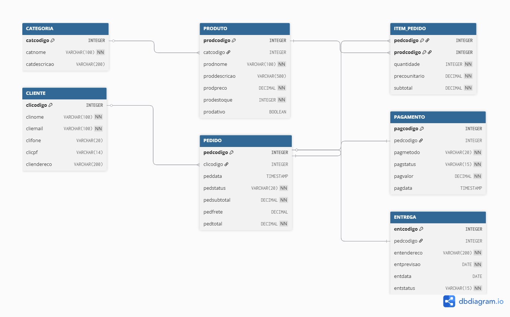

## 4. Projeto da solução

### 4.1. Modelo de dados

_Apresente o modelo de dados por meio de um modelo relacional que contemple todos os conceitos e atributos apresentados na modelagem dos processos._ 

---

### 4.2. Tecnologias

Para o desenvolvimento do sistema Jardim Magnólia, serão utilizadas diversas tecnologias que, em conjunto, possibilitam a construção de uma aplicação web completa, segura e escalável. A solução será estruturada seguindo o modelo cliente-servidor, com separação entre front-end, back-end e banco de dados.

No front-end, serão utilizadas as linguagens HTML, CSS e JavaScript, responsáveis pela construção da interface do usuário. Essas tecnologias permitem o desenvolvimento de páginas web responsivas, interativas e de fácil navegação, proporcionando uma melhor experiência para o cliente durante a utilização da plataforma.

No back-end, será utilizada a linguagem Java com o framework Spring Boot, que facilita a criação de APIs REST, o gerenciamento das regras de negócio e a integração com o banco de dados. O Spring Boot também contribui para a organização do projeto e para a implementação de boas práticas de desenvolvimento.

Para o banco de dados, será utilizado o sistema gerenciador MySQL, responsável por armazenar e gerenciar as informações do sistema, como dados de clientes, produtos, pedidos e pagamentos, garantindo integridade e eficiência nas operações.

Como ferramentas de desenvolvimento, serão utilizadas IDEs como IntelliJ IDEA ou Visual Studio Code, que auxiliam na codificação, organização e depuração do sistema. Para o controle de versão, será utilizado o Git em conjunto com a plataforma GitHub, permitindo o versionamento do código e o trabalho colaborativo entre os integrantes da equipe.

No processo de deploy, será utilizado o GitHub Pages para hospedar o front-end da aplicação, permitindo que o sistema fique acessível via web. Além disso, poderão ser utilizados navegadores como Google Chrome para testes e validação da interface.

Essas tecnologias foram escolhidas por sua ampla utilização no mercado, facilidade de aprendizado e capacidade de atender aos requisitos funcionais e não funcionais do projeto.

| Dimensão           | Tecnologia                  |
| ------------------ | --------------------------- |
| Linguagens         | Java, JavaScript, HTML, CSS |
| Framework Back-end | Spring Boot                 |
| SGBD               | MySQL                       |
| Controle de versão | Git + GitHub                |
| IDEs               | IntelliJ IDEA / VS Code     |
| Front-end          | HTML + CSS + JS             |
| Deploy             | GitHub Pages                |
| Testes             | Google Chrome               |

